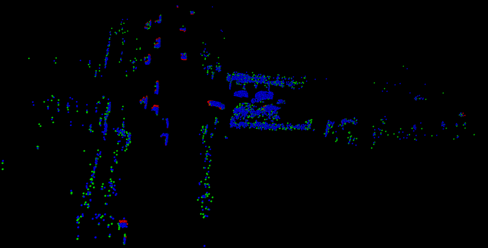
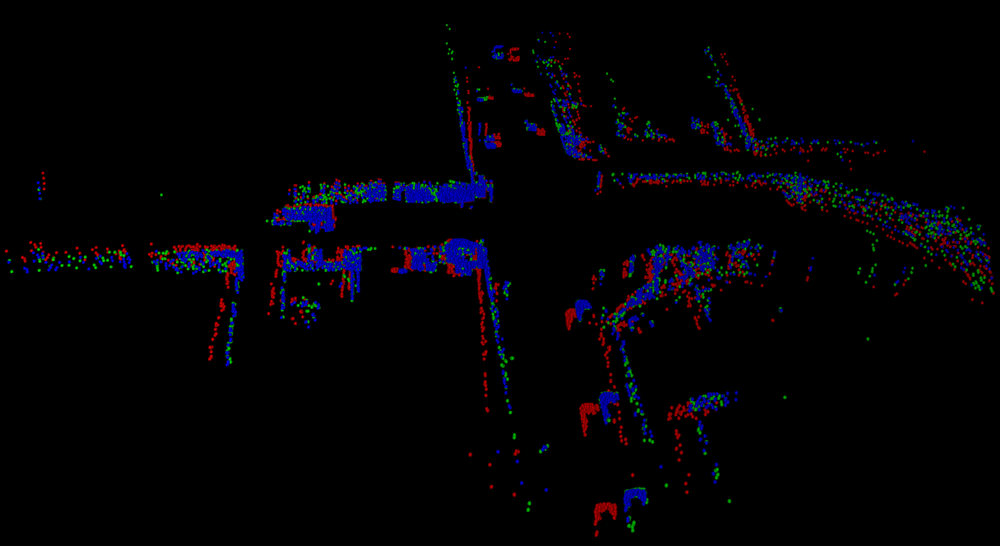
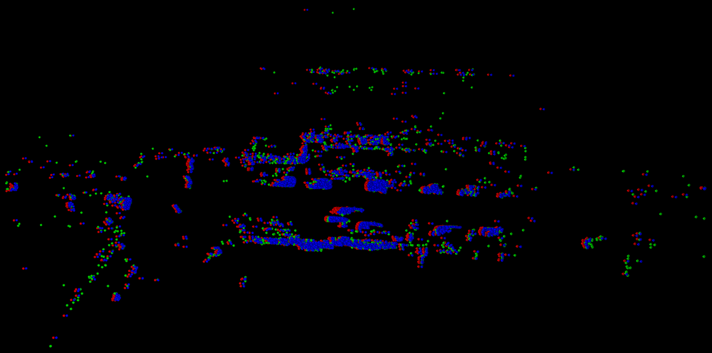
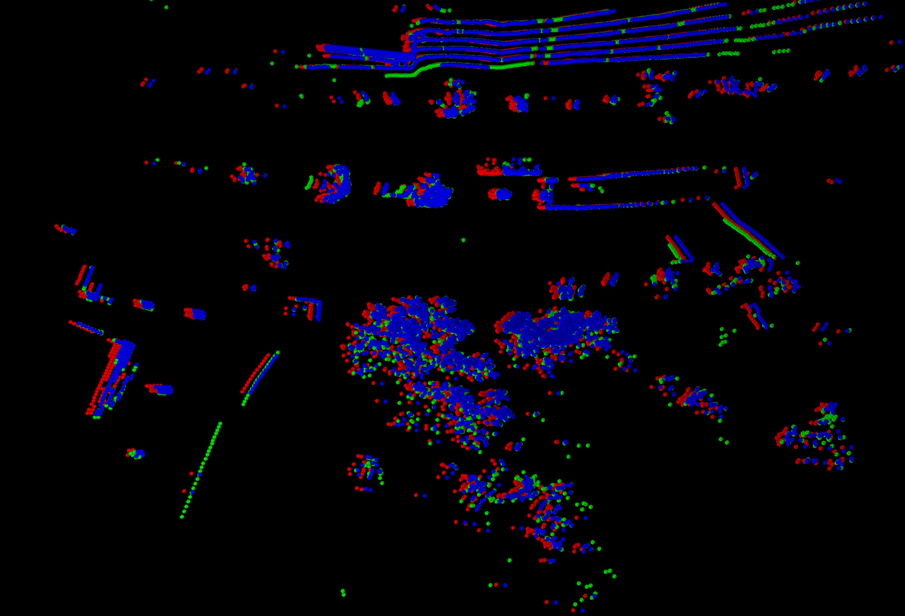
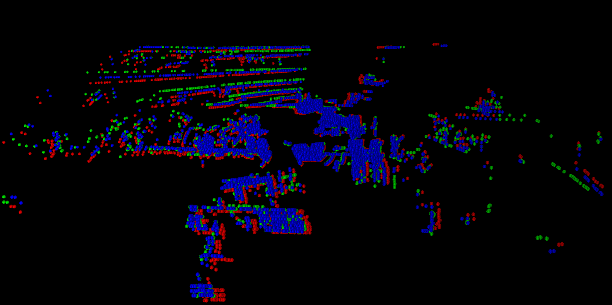
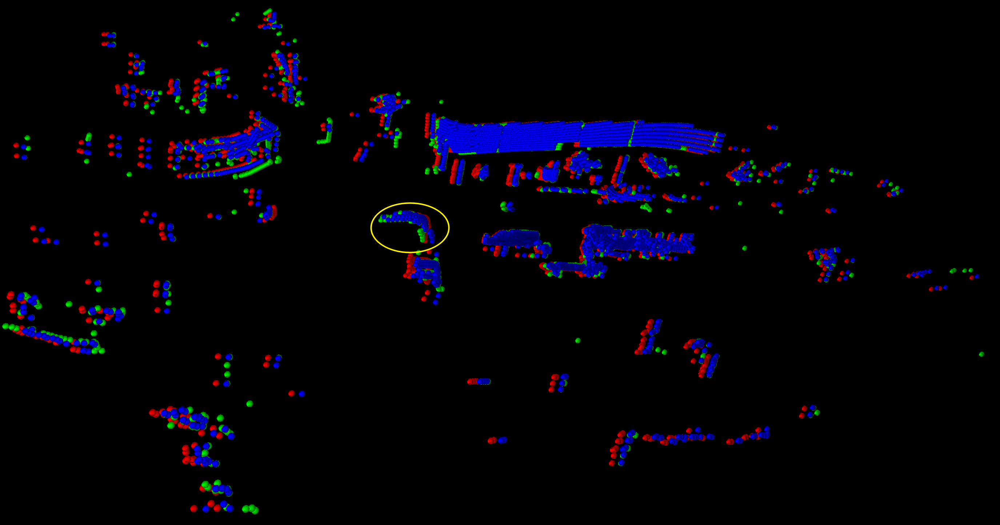

# Datasets Description

This repository contains links to various test sets for 3D rigid scene flow in autonomous driving scenarios, along with the training datasets for the 3DSFLabelling project. Below are the available datasets, download links, and descriptions of the data format and utilities provided.

## Test Sets

### KITTI Test Sets

- **Lidar KITTI Test Set**: 
  - Size: ~160MB
  - [Download lidar_kitti](https://share.phys.ethz.ch/~gsg/weakly_supervised_3D_rigid_scene_flow/data/lidar_kitti.tar)

- **Stereo KITTI Test Set**: 
  - Size: 500MB
  - [Download stereo_kitti](https://share.phys.ethz.ch/~gsg/weakly_supervised_3D_rigid_scene_flow/data/stereo_kitti.tar)

### Argoverse Test Set

- **Argoverse**: 
  - Size: 370MB
  - [Download Argoverse](https://drive.google.com/file/d/1qyTaLz1_CTF3IB1gr3XpIiIDh6klQOA4/view?pli=1)

### Waymo Test Set

- **Waymo Open**: 
  - Size: 453MB
  - [Download Waymo](https://drive.google.com/file/d/1urONegaI6pS47bUv-Kw0nl0oGFzGfIl2/view)

### NuScenes Test Set

- **NuScenes Scene Flow**: 
  - Size: 73MB
  - [Download NuScenes](https://drive.google.com/file/d/1mCjDqJzaMdW0iiM2N2J5BNvo04dAvTbx/view)

## 3DSFLabelling Training Dataset

Below are the links to the 3DSFLabelling annotated training datasets for each environment.

### Argoverse

- [Download Argoverse Training Dataset](https://pan.baidu.com/s/1bJKoMaP5LeeELG52VwHxfQ?pwd=jck0)
  - Access Code: jck0

### NuScenes

- [Download NuScenes Training Dataset](https://pan.baidu.com/s/1O6QR-bF3QVPk_1Qz_5ZkIA?pwd=jck1)
  - Access Code: jck1

### odKITTI

- [Download odKITTI Training Dataset](https://pan.baidu.com/s/1pDAeG4JEokwgaLaEcq21yA?pwd=jck2)
  - Access Code: jck2

## Training Set Data Format

The training dataset is organized into multiple sub-folders within the root directory. Each sub-folder represents a pair of point clouds and their annotation information. The files contained in each folder include:

- `pc1.npy`: Source point cloud.
- `pc2.npy`: Target point cloud.
- `pc3.npy`: Annotated target point cloud. The scene flow ground truth can be obtained by calculating `pc3 - pc1`.
- `anchors.npy`: 3D anchor boxes in the point cloud space.
- `global_params.npy`: Global motion parameters for boxes.
- `perbox_params.npy`: Local motion parameters for boxes.
- `pose.npy`: Ego-motion pose.
- `segmentation.npy`: Motion segmentation information.

## Utility Scripts

- `gen_flow_with_aug.py`: A Python script that can be used to convert global and local motion parameters into 3D scene flow ground truth.
- `vis_flow3D.py`: A Python script for visualizing point clouds and 3D scene flow.

## Scene Flow Testset Usage

We visualized the test set with color coding: **red** for the source frame point cloud, **green** for the target frame point cloud, and **blue** for the point cloud synthesized from the 3D scene flow ground truth and the source frame point cloud. 

The visualization reveals significant discrepancies between the 3D scene flow ground truth and the target frame point cloud, which greatly affects the accurate performance evaluation of models. To mitigate the impact of inaccuracies in the ground truth, we use the point cloud generated from the 3D scene flow ground truth and the source frame as the target frame point cloud, applying random sampling to minimize the influence of any ground truth errors on the evaluation.

### Visualization of Argverse Scene Flow Test Set
**When the ground truth of the 3D scene flow is completely accurate, the blue and green point clouds should completely overlap.**

  

### Visualization of NuScenes Scene Flow Test Set
When the ground truth of the 3D scene flow is completely accurate, the **blue** and **green** point clouds should completely overlap.

  
