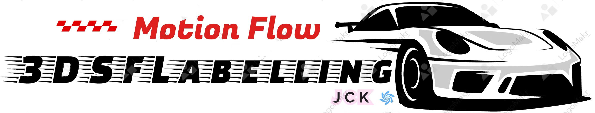

    
   

## *CVPR 2024* | 3DSFLabelling: Boosting 3D Scene Flow Estimation by Pseudo Auto-labelling 

Check out the project demo here: [3DSFLabelling-Page](https://jiangchaokang.github.io/3DSFLabelling-Page/)

#### The code is gradually being released, please be patient.
[poster coming soon] [video coming soon]

| Description | Simple Example of the Auto-Labelling |
|-------------|-------|
| The proposed 3D scene flow pseudo-auto-labelling framework. Given point clouds and initial bounding boxes, both global and local motion parameters are iteratively optimized. Diverse motion patterns are augmented by randomly adjusting these motion parameters, thereby creating a diverse and realistic set of motion labels for the training of 3D scene flow estimation models. |  |

